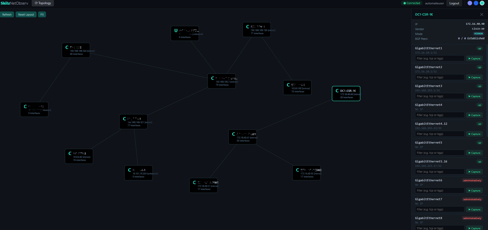

# SkilzNetObserv

A browser-based real-time packet analyser built on a production-pattern Kubernetes platform.
Click a device. Click an interface. See live packets with full protocol decode.

---

## Why this exists

Getting visibility into traffic flowing across a multi-vendor infrastructure estate is probably more complicated than most people would like it to be. Each platform has a different approach to packet capture, different syntax, different constraints, and different levels of access required. When the estate spans devices from multiple vendors, there is no single centralised place from which to see what is happening across all of them simultaneously. The result is typically a series of separate sessions, separate capture files, and a manual process of exporting and opening each one locally before any analysis can begin.

In a secured environment this is compounded further. Maintaining interactive sessions on production equipment requires justification, approval, and in many cases is simply not permitted. Any tooling that holds open connections to network devices, or that cannot demonstrate a clear boundary around when it interacts with equipment and when it does not, is difficult to operate within a governed environment.

The approach taken here addresses both concerns. ERSPAN (Encapsulated Remote SPAN) is a mechanism supported across Cisco, Arista, and Juniper platforms that copies traffic from a device interface at the hardware level and forwards it as a GRE-encapsulated stream to a collector. The device mirrors traffic in the ASIC. There is no process running on the equipment during capture, no interactive session, no CPU impact. The collector receives the stream passively, decapsulates the GRE frames, and decodes the inner packets in real time using the same dissector library Wireshark uses.

The result is a browser-based tool where an engineer can click on any device in a live topology map, select an interface, and immediately see every packet flowing on that interface decoded to full protocol depth, without opening a session on the device and without exporting files to a local machine. Capture starts when requested and stops the moment the session is closed.

---

## The platform

The application needed a home, and building that home turned into its own project. The platform underneath SkilzNetObserv closely mirrors what an acceptable production Kubernetes deployment looks like: a proper two-tier PKI, Active Directory for identity, Vault for secrets with no plaintext credentials anywhere in the codebase, NGINX ingress with automatic TLS issuance, distributed block storage, and a management plane deliberately separated from the workload plane.

Building it was one of the most effective ways of reinforcing how Kubernetes actually works in depth. Not just deploying a container and calling it done, but working through HA control planes and etcd quorum, how kube-vip relates to VRRP, how Calico BGP underpins pod networking, what cert-manager does when it talks to a Windows enterprise CA, how Vault AppRoles scope secrets to individual applications, and what it takes to make a pod that needs access to a raw network socket run safely in a cluster.

Every module in this repository maps to something that would come up in a real production environment. The modules that were hardest to build are the ones that taught the most.

---

## Running this on limited hardware

The full platform spans nine virtual machines. Not everyone has the hardware for that, and it is not a requirement for getting value from this project.

A single Kubernetes node running on a laptop alongside a lightweight Windows Server VM for Active Directory and certificates is enough to deploy NetObserv, Nautobot, Vault, and the observability stack, and to follow every module in this guide. The Kubernetes concepts are identical at any scale. What a single-node setup cannot demonstrate are failure domain boundaries and etcd quorum behaviour under node loss, but those are covered in the documentation regardless of the physical topology used.

The `00-prerequisites/day0-vm-infrastructure.md` file includes a dedicated section on minimal configurations, with guidance on which components simplify at smaller scale, a suggested two or three VM layout that runs on a 16 GB laptop, and notes on what changes and what stays the same. Start with what is available.

---

## What is coming next

The longer-term goal for this platform is to improve and manage itself through a combination of internally hosted AI agents and a mature CI/CD pipeline. The idea is that routine operational decisions, configuration drift detection, anomaly identification in captured traffic, and graduated rollouts of changes should all flow through a governed, automated process rather than relying on manual intervention. The platform is being built in a way that makes that goal achievable incrementally rather than requiring a complete redesign later.

For the networking side, the aim is to extend SkilzNetObserv to cover a wider range of vendors and capture scenarios, and to connect it more tightly to Nautobot so the device inventory is driven entirely from the network source of truth rather than a static registry.

---

## If you are on a similar journey

This project is published in the hope that it is useful to others on a similar path, whether that means approaching Kubernetes for the first time, reinforcing knowledge at a more advanced level, or looking for a practical way to address long-standing network visibility challenges across a multi-vendor estate. Every decision in the build is documented, including the things that did not work first time.

Pull requests and issues are welcome on the public repository. If something is unclear, documented incorrectly, or could be done better, raising an issue or opening a pull request is the right way to contribute. No contribution is too small.

---

## High-Level Architecture

```
 NETWORK DEVICES

 Cisco (IOS, IOS-XE, IOS-XR, ASR, CSR, FTD)   Arista EOS
 Palo Alto PAN-OS   ContainerLab
 Juniper (EX/QFX/MX, SSH capture; ERSPAN support partial)
 any device supporting ERSPAN or SSH shell

        |                                          |
        | ERSPAN (Mode 1, primary)                 | SSH pipe (Mode 2, fallback)
        | GRE mirror, passive, zero device CPU     | opens on capture start
        | impact, no session on device             | closes on stop
        v                                          |
 KUBERNETES CLUSTER  (3 control planes, 3 workers)

 Platform: Calico   kube-vip   MetalLB   NGINX Ingress
           cert-manager (ADCS)   Longhorn   Prometheus/Grafana

 +-----------------------------+   +----------------------------------+
 |  Nautobot  (SSoT)           |   |  HashiCorp Vault  (3-pod Raft HA)|
 |  nautobot namespace         |   |  vault namespace                 |
 |                             |   |                                  |
 |  Network Source of Truth    +-->|  SSH credentials per device      |
 |  device names and vendors   |   |  SNMPv3 credentials              |
 |  management IPs             |   |  AD bind passwords               |
 |  capture mode per device    |   |  AppRole token per app           |
 |  SNMPv3 credentials         |   |  no plaintext anywhere           |
 +-------------+---------------+   +----------------+-----------------+
               |                                    |
       (1) device list                    (2) SSH creds per device
         name, vendor, mgmt IP               fetched on capture start
         capture mode                        via AppRole token
               +--------------------+--------+
                                    v
 +--------------------------------------------------------------------+
 |  SkilzNetObserv  (netobserv namespace, pinned to k8s-w-03)         |
 |  Jumpbox: k8s-jb (192.168.13.245), admin access only              |
 |                                                                    |
 |  server.js    reads Nautobot (SSoT) for device list               |
 |               reads Vault for SSH creds on each capture start     |
 |               Express + WebSocket, AD-gated login                 |
 |                                                                    |
 |  decoder.js   tshark subprocess, pcap to per-packet JSON          |
 |                                                                    |
 |  collector.js raw GRE socket, ERSPAN decap, named FIFO  <-- ERSPAN|
 +--------------------------------------------------------------------+

              NGINX Ingress   MetalLB VIP   TLS (cert-manager, SubCA)

 IDENTITY AND PKI  (Windows Server 2022)

 Active Directory   user auth (sAMAccountName), LDAP group enforcement
 Enterprise SubCA   signs all service TLS certs via cert-manager
 DNS                all *.skilz.io records
 NFS server         ReadWriteMany storage volumes for the cluster

 BROWSER  (any device on the network)

 https://netobserv.skilz.io      live packet capture (AD login)
 https://nautobot.skilz.io       network source of truth
 https://vault.skilz.io          secrets management
 https://grafana.skilz.io        metrics and dashboards (Module 07)
 https://gitlab.skilz.io         CI/CD (Module 05)
```

---

## SkilzNetObserv: How It Works

### Two Capture Modes

**Mode 1: ERSPAN (hardware mirror, primary mode)**

The device mirrors traffic in hardware via ERSPAN and forwards it as a GRE stream to the collector running on `k8s-w-03`. This is configured once per device. During a capture the server reads the incoming stream, decapsulates it, and decodes it in real time. Nothing connects to the device at capture time. The device is completely unaware a capture is in progress.

Verified on Cisco IOS-XE, IOS-XR, NX-OS, and Arista EOS. For Palo Alto firewalls, ERSPAN is sourced from the upstream switch mirroring traffic towards the firewall rather than from the firewall itself. Juniper platforms advertise GRE-based port mirroring but their on-device encapsulation does not consistently match ERSPAN Type II; collector-side support for Juniper is present but requires per-platform validation before use in a live environment.

**Mode 2: SSH pipe (fallback, Linux-based and virtual devices)**

Used for devices that expose a Linux shell where `tcpdump` is available directly, primarily ContainerLab containers and Arista EOS in bash mode. Juniper JunOS also supports this path via SSH shell. An SSH session opens when capture starts, `tcpdump -w -` streams raw pcap bytes over the channel, and the session closes the moment capture stops. Nothing lingers on the device after the session ends.

This mode is not applicable to standard Cisco IOS or IOS-XE without guestshell configured, and is not available on most production routing platforms without shell access enabled.

**Traffic trace (cross-device ERSPAN, Cisco only)**

A separate trace mode simultaneously configures an ERSPAN mirror session on every eligible Cisco IOS and IOS-XE device in the topology, using session ID 2 to avoid colliding with the per-interface capture session. When a packet matching the defined filter arrives from any device, the originating device and interface are surfaced in real time. Arista and Juniper are skipped in this mode. Credentials are held in memory for the duration of the trace and zeroed out on stop.

| Property | ERSPAN (Mode 1) | SSH pipe (Mode 2) | Traffic trace |
|---|---|---|---|
| Connection to device during capture | None | One SSH session | SSH to configure, then passive |
| Process on device during capture | None, hardware mirror | tcpdump running | ERSPAN session active |
| Device CPU impact | Zero | Minimal | Negligible |
| Vendor support | Cisco, Arista (Juniper: limited) | Linux shell, ContainerLab, Juniper JunOS | Cisco IOS / IOS-XE only |
| Best suited for | Production hardware | Lab and virtual devices | Cross-device traffic correlation |

### ERSPAN Packet Pipeline (Mode 1)

```
Switch interface
    |
    |  ERSPAN Type II: GRE (proto 47), inner proto 0x88be
    v
192.168.16.12  k8s-w-03 host NIC (hostNetwork: true)
    |
    v
collector.js: tshark -i any -f "proto gre" -F pcap
    |  strips Ethernet, IPv4, GRE, ERSPAN header
    |  recovers inner Ethernet frame
    |  maps outer source IP to device name via Nautobot mgmt_ip
    |
    v
named FIFO (/tmp/netobserv-<random>.pcap)
    |  mkfifo used because tshark cannot read from Unix sockets
    |
    v
decoder.js: tshark -i <fifo> -T json -l -x [-Y filter]
    |  real-time JSON per packet
    |  incremental JSON parser extracts packet objects
    |
    v
server.js, WebSocket, Browser
    CaptureWindow renders live rows, protocol tree, hex dump

tracer.js runs alongside capture.js as a separate session manager.
It configures ERSPAN session 2 on all eligible Cisco devices simultaneously,
filters incoming frames against user-defined rules, and emits a 'hit' event
per match without opening a dedicated per-device capture window.
```

### Security Boundary

ERSPAN is completely passive. The original traffic is copied at the hardware level. Forwarding, latency, and routing on the device are not affected. The only switch resource consumed is the ERSPAN session counter.

---

## Platform Stack

### Infrastructure

| Layer | Technology | Purpose |
|---|---|---|
| Hypervisor | VMware | 9 VMs across 3 subnets |
| OS | Ubuntu 24.04 LTS | K8s nodes, management box |
| Identity | Active Directory (Windows Server 2022) | Domain auth, DNS, Group Policy |
| PKI | Offline Root CA and Online Enterprise SubCA | TLS chain for all services |

### Kubernetes Platform

| Component | Version | Role |
|---|---|---|
| Kubernetes | v1.32.13 | 3 control planes, 3 workers |
| kube-vip | v1.2.0 | K8s API HA virtual IP |
| Calico | v3.30.1 | CNI, pod networking and BGP |
| MetalLB | v0.14.9 | LoadBalancer VIP for Ingress |
| NGINX Ingress | v1.12.2 | Ingress routing, WebSocket |
| cert-manager | v1.17.2 | Automatic TLS issuance via ADCS |
| Longhorn | v1.12.0 | Block storage on worker sdb disks |
| HashiCorp Vault | v2.0.2 | 3-pod Raft HA, all secrets |

### Applications

| Application | Namespace | Description |
|---|---|---|
| SkilzNetObserv | `netobserv` | Real-time browser packet analyser |
| Nautobot | `nautobot` | Network Source of Truth, device registry |
| Prometheus and Grafana | `monitoring` | Metrics and dashboards (Module 07) |
| Kubernetes Dashboard | `kubernetes-dashboard` | Cluster GUI |
| GitLab CE | Separate VM | Source control and CI/CD (Module 05) |

---

## Credential Management

All credentials are managed exclusively by HashiCorp Vault. No passwords, usernames, tokens, or keys exist in this repository, in application code, or in environment files.

### Vault secret structure

```
secret/
  devices/
    <device-name>/          SSH credentials per network device
      ssh_user
      ssh_password

  platform/
    ldap/                   AD bind passwords per application
    snmpv3/                 SNMPv3 credentials (username, auth, priv)
```

### How applications get credentials

Each application has a dedicated AppRole in Vault with a scoped policy. The Vault Agent sidecar injects the AppRole credentials at pod startup. The application never sees a password, only a Vault token scoped to its own paths.

```
App pod                      Vault Agent sidecar
  |                               |
  |  <- /vault/secrets/creds -----+-- reads from Vault at pod start
  |                               |   injects as file or env var
  |  uses token, never password   |
```

```
Nautobot AppRole  reads secret/data/devices/*  and  secret/data/snmpv3/*
NetObserv AppRole reads secret/data/devices/*
```

---

## CI/CD Roadmap (not yet live)

The goal is a fully automated delivery pipeline for both Nautobot and SkilzNetObserv.

```
Developer pushes to GitLab

          Build             Test              Deploy to K8s
            |                 |                    |
      docker build       unit tests          kubectl rollout
            |           integration          (Recreate strategy)
      push to            tests                    |
      registry                            notify Slack/webhook
```

**Pipeline: SkilzNetObserv**

Build image, push to GitLab Container Registry (`registry.gitlab.skilz.io/root/netobserv`), restart the deployment, run a smoke test to confirm the WebSocket connects and the collector is receiving GRE frames, then roll back automatically if the check fails.

**Pipeline: Nautobot**

Build the custom Nautobot image with plugins baked in, run `nautobot-server migrate` as a Kubernetes Job before the deployment, perform a rolling update, and smoke test the API endpoint.

Current state: the NetObserv image is built manually from `k8s-jb` and pushed to a local registry. The GitLab CI pipeline exists but is not yet connected to the registry. The full transition is documented in `05-cicd/gitlab-pipeline.md`.

---

## Repository Structure

```
skilz.io/
  README.md
  .gitignore                                excludes CREDENTIALS.md and secrets
  00-prerequisites/
    day0-vm-infrastructure.md               VM setup, networking, SSH, domain join
    day0-active-directory-and-pki.md        AD, DNS, Root CA, SubCA, NFS
  01-foundations/
    ha-kubernetes-cluster.md                kubeadm HA cluster, kube-vip, Calico
  02-networking/
    calico-bgp-metallb-nginx.md             CNI, load balancer, ingress controller
    cert-manager-adcs-workflow.md           TLS automation via cert-manager and Windows ADCS
  03-storage/
    longhorn-persistent-storage.md          Longhorn block storage and NFS ReadWriteMany
  04-secrets/
    vault-secrets-management.md             Vault 3-pod HA, AD auth, AppRole, policy
  05-cicd/
    gitlab-pipeline.md                      GitLab CE and runner (planned, not yet live)
  06-netobserv/
    NETOBSERV-SOLUTION-OVERVIEW.md          Architecture, capture modes, WebSocket protocol
    netobserv-build.md                      Step-by-step build, all bugs and fixes
    tracer-design.md                        Traffic trace session manager design and Cisco ERSPAN config
    pictures/                               UI screenshots
  07-observability/
    observability-stack.md                  Prometheus, Grafana, Loki (next)
  08-nautobot/
    nautobot-build.md                       Nautobot NSoT: build, Vault, SSoT discovery
  09-operations/
    node-maintenance.md                     Graceful drain, node rejoin, recovery
    security-patching.md                    OS patches, K8s upgrades, air-gap plan
  10-dashboard/
    kubernetes-dashboard.md                 K8s Dashboard, ADCS TLS, token auth
  snmp-configs/
    cisco-iosxe.conf                        SNMPv3 config for Cisco IOS-XE
    arista-eos.conf                         SNMPv3 config for Arista EOS
    juniper-junos.conf                      SNMPv3 config for Juniper JunOS
```

---

## Build Order

Each module depends on the one before it. This is the order the platform was built.

| Phase | What it covers | Status |
|---|---|---|
| Day 0 | VMs, static IPs, SSH, domain join, base config | Done |
| Day 1 | AD, DNS, Root CA, SubCA, NFS | Done |
| Module 01 | HA K8s cluster, kube-vip, Calico | Done |
| Module 02 | MetalLB, NGINX Ingress, cert-manager, ADCS, TLS | Done |
| Module 03 | Longhorn block storage, NFS StorageClass | Done |
| Module 04 | Vault 3-pod HA, AD auth, AppRole, root token revoked | Done |
| Module 05 | GitLab CE and runner, K8s integration | Planned |
| Module 06 | SkilzNetObserv, packet analyser, live, AD-gated | Done |
| Module 07 | Prometheus, Grafana, Loki | Next |
| Module 08 | Nautobot NSoT, SSH discovery, Vault creds, SSoT sync | Done |
| Module 09 | Cluster operations, drain, maintenance, recovery | Done |
| Module 10 | Kubernetes Dashboard, ADCS TLS, bearer token auth | Done |

---

## Network Layout

```
192.168.13.0/24  management
  .199  rootca     Offline Root CA (powered off after Day 1)
  .245  k8s-jb     Jumpbox, kubectl, helm, SSH to all nodes, VS Code Remote SSH

192.168.14.0/24  K8s zone 1 and GitLab
  .11   k8s-cp-01  Control plane
  .12   k8s-w-01   Worker (Longhorn disk)
  .13   gitlab-srv GitLab CE and runner (Module 05)
  .30   kube-vip   K8s API HA VIP (no VM, software)
  .31   MetalLB    Ingress VIP, all *.skilz.io services

192.168.15.0/24  K8s zone 2 and DC
  .10   dc         Domain Controller, DNS, SubCA, NFS
  .11   k8s-cp-02  Control plane
  .12   k8s-w-02   Worker (Longhorn disk)

192.168.16.0/24  K8s zone 3
  .11   k8s-cp-03  Control plane
  .12   k8s-w-03   Worker (Longhorn disk), NetObserv ERSPAN collector
```

The management subnet (`192.168.13.0/24`) is dedicated to administrative access. All kubectl, helm, and SSH work goes through `k8s-jb`. This keeps the management plane separate from cluster traffic.

The NetObserv pod is pinned to `k8s-w-03` because the pod runs with `hostNetwork: true`. The GRE/ERSPAN collector opens a raw socket on the physical host NIC, and switches send ERSPAN frames to `192.168.16.12` specifically. If the pod moved to another node, every switch ERSPAN session would need reconfiguring before captures would work again.

---

## Key Design Decisions

**Why `hostNetwork: true` for NetObserv?**
ERSPAN arrives as raw GRE frames at the node NIC. Without `hostNetwork: true` the pod's network namespace is isolated from the physical interface and the GRE frames are never seen.

**Why is GitLab outside the cluster?**
A CI/CD system that manages a cluster cannot run inside that same cluster. If the cluster has a problem, GitLab needs to be available to push a fix. Running it on a separate VM keeps that path open.

**Why an offline Root CA?**
The Root CA VM is powered off after signing the SubCA certificate. It has no ongoing network access. If the SubCA is ever compromised, the Root CA can be powered on, the SubCA revoked, and a new one issued. An always-on Root CA with its private key permanently exposed on a networked machine removes that recovery option.

**Why tshark via named FIFO instead of a socket?**
tshark rejects Unix domain sockets as capture sources. A named FIFO (`mkfifo`) presents as a regular filesystem path. tshark opens it as a live capture interface (`-i <fifo>`), which processes packets in real time rather than buffering until EOF as the `-r` mode does.

**Why an AppRole per application in Vault?**
Each application's Vault token is scoped only to the paths it needs. A compromised Nautobot token cannot read NetObserv secrets. The root token is revoked after initial setup so there is no master credential that unlocks everything.

---

## Screenshots

| Login | Live Capture | OSPF Filter | Packet Detail |
|---|---|---|---|
|  |  |  |  |

---

## Contributions

Pull requests and issues are welcome. If something is wrong, unclear, or could be improved, please raise an issue or open a pull request on the public repository. Suggestions on extending vendor support, improving the capture pipeline, or hardening the platform further are particularly welcome.

---

## Modules

Documentation for each module is underway and will be published here after validation.

| Module | Topic |
|---|---|
| 01-foundations | HA Kubernetes cluster, kubeadm, kube-vip, Calico CNI |
| 02-networking | MetalLB, NGINX Ingress, cert-manager, ADCS TLS workflow |
| 03-storage | Longhorn block storage, NFS StorageClass |
| 04-secrets | Vault 3-pod HA, AD auth, AppRole, scoped policies |
| 05-cicd | GitLab CE, runner, Kubernetes integration |
| 06-netobserv | SkilzNetObserv architecture, capture pipeline, ERSPAN config, build log |
| 07-observability | Prometheus, Grafana, Loki |
| 08-nautobot | Nautobot network source of truth, Vault integration, SSoT discovery |
| 09-operations | Node maintenance, graceful drain, recovery procedures |
| 10-dashboard | Kubernetes Dashboard, ADCS TLS, bearer token auth |
